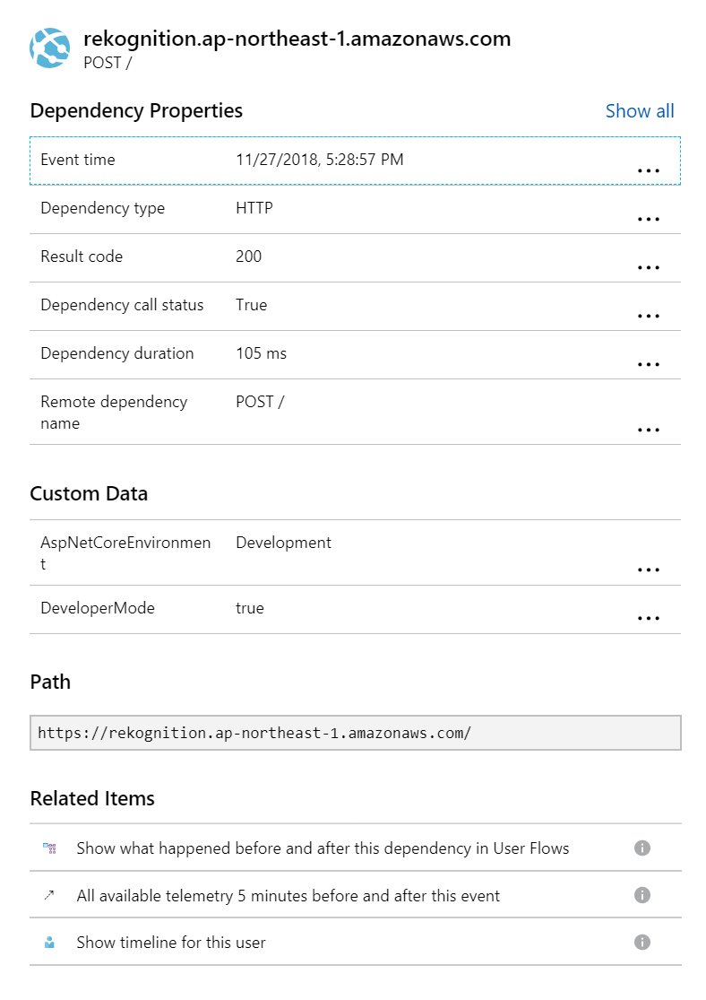
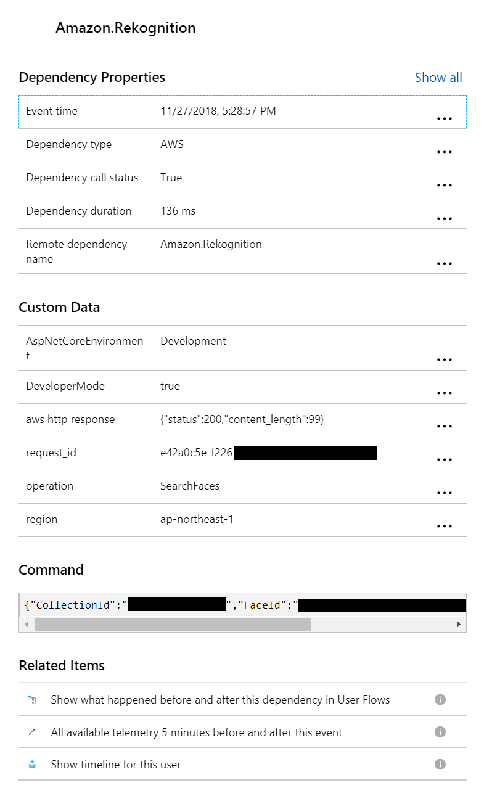
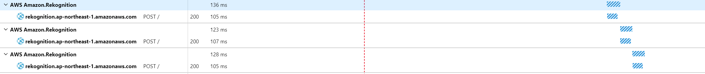
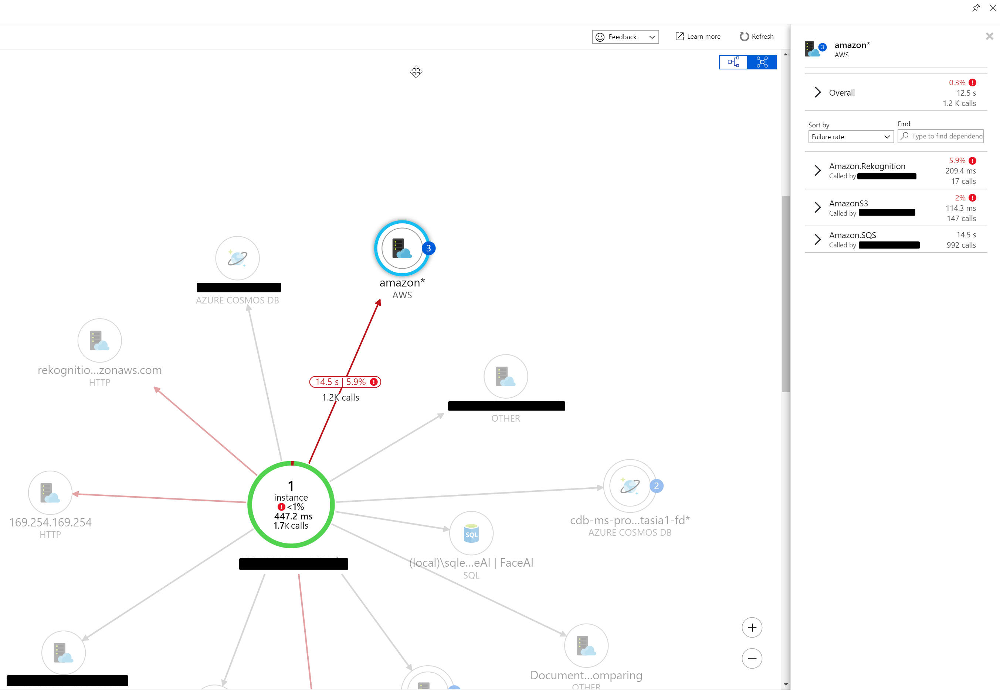

# ApplicationInsights.AWS [](https://ci.appveyor.com/project/hermanho/applicationinsights-aws) [](https://travis-ci.com/hermanho/ApplicationInsights.AWS) [](https://www.nuget.org/packages/ApplicationInsights.AWS/) 

When you have enable Application Insights, all external http requests are recorded. However, those AWS requests are recorded without payloads because the parameters are transferred in different way.




This library will extract the payloads and show you in Application Insights




It also group AWS requests in Application map



## Install
Install from Nuget and search "ApplicationInsights.AWS"


## Setup
Add "AddAWSInjection()" in ConfigureServices
```
public void ConfigureServices(IServiceCollection services)
{
    services.AddApplicationInsightsTelemetry();
    services.AddAWSInjection();
}
```
